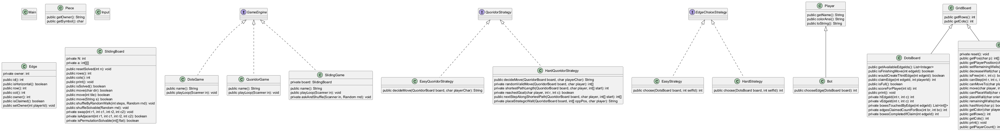
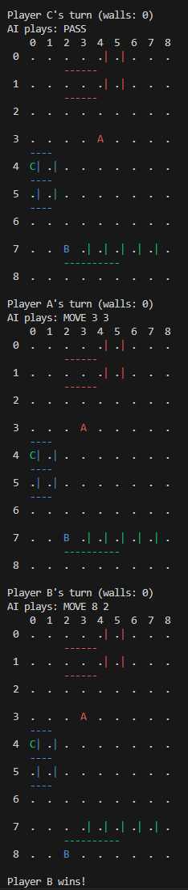

# CS611-Assignment 3
## Quoridor Game 

---------------------------------------------------------------------------
- **Name**: [Jingfeng Li]&
            [Ziyang Wang]
- **Email**: [ljf628@bu.edu]&[zywang1@bu.edu]
- **Student ID**: [U73840242]&[U12285471]

## Files
---------------------------------------------------------------------------
### `app/`
- **`Main.java`** — Game starting entry.

---

### `core/`

####  Game Base & Player Logic
- **`GameEngine.java`** — Common interface defining the `playLoop()` method for all games.  
- **`GameBoard.java`** — Abstract base for grid-based boards; provides dimensions and rendering methods.  
- **`Player.java`** — Defines player attributes including name, id, and type (human or Bot).  
- **`Bot.java`** — Abstract Bot class; uses strategy pattern for varying difficulty levels.  

####  `core/strategy/`
- **`EdgeChoiceStrategy.java`** — Strategy interface for DotsGame's edge selection palying logic used by bots.  
- **`EasyStrategy.java`** — Random move selection; represents the **EasyBot** behavior.  
- **`HardStrategy.java`** — Based on designing an algorithm that allowing bot can select A more profitable approach.
- **`QuoridorStrategy.java`** — Strategy interface for Quoridor Game palying logic used by bots.  
- **`EasyQuoridorStrategy.java`** — Random move or place wall selection(half & half); represents the **EasyBot** behavior.  
- **`HardQuoridorStrategy.java`** — Based on designing a BFS algorithm that allowing bot can select a more profitable approach.

#### `core/ui/`
- **`TextUtil.java`** — Text rendering and beautification of terminal display
---

### `dots/`
- **`DotsGame.java`** — Implementing the game logic for **Dots & Boxes**.
- **`DotsBoard.java`** — Representing the dot grid and tracks claimed edges and completed boxes.  
- **`Edge.java`** — Representing an edge connecting two dots and recording ownership and position.

---
### `sliding/`
- **`SlidingGame.java`** — Game loop for **Sliding Puzzle**.
- **`SlidingBoard.java`** — Implementing the NxN tile board, supporting shuffling, movement, and completion checks.
### `quoridor/`
- **`QuoridorGame.java`** — Game loop for **Quoridor Game **.
- **`QuoridorBoard.java`** — Creating board, initialize player position, completion checks and provide move or wall action.

---
## File Structure and UML
---------------------------------------------------------------------------
---
### `File Structure `
src/main/java/zyjfassignment/boardgames/
├── app/
│   └── Main.java
├── core/
│   ├── GameEngine.java
│   ├── GameBoard.java
│   ├── Player.java
│   ├── Bot.java
│   ├── strategy/
│   │   ├── EdgeChoiceStrategy.java
│   │   ├── EasyStrategy.java
│   │   └── HardStrategy.java
│   └── ui/
│       └── TextUtil.java
├── dots/
│   ├── DotsGame.java
│   ├── DotsBoard.java
│   └── Edge.java
└── sliding/
    ├── SlidingGame.java
    └── SlidingBoard.java


---
### `UML`


## Notes
---------------------------------------------------------------------------
- This project demonstrates modular object-oriented design, employing inheritance, composition and strategy patterns. 
- The GameEngine interface provides a unified abstraction for different board games, achieving polymorphism among game implementations.   
- QuoridorGame combines the QuoridorBoard and manages multiple players, supporting both human players and AI players.   
- Player actions are implemented through the strategy pattern: EasyQuoridorStrategy and HardQuoridorStrategy encapsulate the AI decision-making logic, which can be dynamically switched to adjust the difficulty. 
- The design places great emphasis on scalability, allowing for the addition of new games, strategies or board types with minimal modifications.
- Designed more multiplayer battles and different color displays
---

## How to compile and run
---------------------------------------------------------------------------
1. Openning the terminal
2. Running the following instructions:
   - cd ......(the path of files) (Enter the directory the code is stored);
   - Remove-Item .\sources.txt (Clean up generated or temporary files. You can delete the old "sources.txt" file to avoid using outdated ones.)
   - Get-ChildItem -Path .\main\java -Recurse -Filter *.java | （Recursively search for the complete paths of all .java files in the directory, and write these paths in ASCII encoding to the file named "sources.txt".）
    >>     Select-Object -ExpandProperty FullName |
    >>     Out-File -Encoding ascii sources.txt
   - javac -d out "@sources.txt" (Compiling all java files);
   - java -cp out zyjfassignment.boardgames.app.Main(Executing java programme).
## Input/Output Example
---------------------------------------------------------------------------
### `Screen Shoot`



```text
PS C:\Users\14661\Desktop\src> java -cp out zyjfassignment.boardgames.app.Main
Choose a game: 1) Dots & Boxes  2) Sliding Puzzle  3) Quoridor
3
Enter number of players (2–4): 3
Welcome to Quoridor!
Players detected: 3
Is player A an AI?  (1-none / 2-easy / 3-hard): 3
Is player B an AI?  (1-none / 2-easy / 3-hard): 3
Is player C an AI?  (1-none / 2-easy / 3-hard): 3
......

 


